#### iBlog 开发文档及模块说明 

Blog 个人博客系统

一开始框架参考于：

https://github.com/Zhangyei/iBlog & https://github.com/jiangjiu/vue-leancloud-blog
ISC许可证与MIT许可证  
谢谢大佬的开源  

取其精华、去其糟粕

用最新的版本的框架进行重构

########################################  

6.14

先读懂后端别人是怎么写的  

6.15

终于有点看懂了我天  
我发现这是一个前后端不分离的项目  
现在在此之上做出一些重构和改进，前后端分离  
6.16

前端（游客界面）找了一个简洁好看的模板开始研读  
6.17

vue双向绑定真香  
尝试修改界面，增加登录界面    
猜前端接口的用意，尝试编写后端接口   

噢，我一定要说一下，我今天真的是在mongodb find返回值 和 异步 上面吃大亏了呜呜呜呜，网上还搜不到，一整天基本就弄了这一个东西  
mongodb.find({})返回的是document类型而不是object类型！！！！！  
所以返回的就是一大堆看都看不懂的东西也不知道哪里来的东西  
哇难受  
还有就是nodejs是异步的！异步的！异步的！重要的事情说三遍  

```javascript
var contentListValue
routerApi.get('/content-list', function (req, res) {
    ContentList.find({}).lean().exec((err, docs) => {
        contentListValue = docs
        console.log(contentListValue);
        res.json(contentListValue);
      })
```

find后面要用lean().exec((err, docs)xxxxx这种方式  
还有 res.json(contentListValue)一定要放在这个方法内部！！！！  
放在外面就会提前执行，在lean()方法完成前就执行了，然后就一直都是undefind哇难受  
重点是这两个问题发生在了一起，我可能早些时候已经试对了，但还是最后返回undefind，我又一直搜搜搜 难受啊表达出来发泄一下  
还好现在终于解决了

6.18

--完成首页的初步展示

后端时间格式返回还是这样方便  

```javascript
const moment = require('moment')
result.createdAt = moment(String(item.createAt)).format('YYYY-MM-DD hh:mm:ss');
```

是不很明白之前为什么要写的那么繁杂 

--完成文章内容显示

find和findOne差距还是挺大的

开始制作注册登录

get新框架Element UI

前端ui也好难

6.20

昨天一整天12个小时，全部花在一个bug上了，我试了所有我能想到搜到的方法，但是element UI永远是无效的跟vue结合不到一起，最后报的错已经搜不到了。

当时难受极了，气得我饭都吃不下去。绝望的时候我然想到了我的舅舅，他也是弄计算机方面的，我就尝试着问了问。

我把project发给他，让他帮我看一下，最后他也没弄出来他说他太久没用了，我就问问他有没有想法，有想法就好我还能试试，然后他就说出了关键问题！！！！！！版本的问题。

下午我已经确实确实是版本的问题了，我建了一个新项目的开始移植代码。

我找的这个项目太老了，跨大版本很多语法都变了

现在开始前端从全部重构！虽然我知道我又踩进了一个大坑。。。先试试吧。

6.22

终于有些弄明白vuex了

三个大版本的迭代后变化太大了，前端基本全部要重构

vue-resource也已经停止维护了，现在改用axios，踩了太多坑了

6.23

axios已经默认不使用cookies了，我查了半天

已经熟练使用vuex了

完成内容板块管理

完成注册功能

真的快气晕了，终于实现了跟管理端的连接，然后发现有几个UI按钮没有出现，de了三小时bug，最后发现是因为虚拟机窗口太小了，把按钮挤没了，根本不是程序里没有把他展示出来，这种错误真的debug de的我怀疑人生[裂开]

整个博客终于有一点像样了哈哈哈哈

完成用户登录功能

开始比较得心应手了

出现bug基本都知道怎么找、要怎么改了

完成权限功能

6.24

完成用户管理功能

解决板块内容无法跳转bug

解决内容管理作者不显示

优化跳转界面

解决用户登录bug

解决用户删除不完整bug

6.25

解决article不显示headTitle的bug

解决了一些样式问题

解决了第一次登录永远显示失败（实则已经成功），有时候明明密码错的也可以显示登录成功（实则失败）的bug，又是一个异步的问题

解决了账号如果是中文无法登录的问题（cookie不支持中文，需要encode、decode）

```javascript
解决方案：
设置cookies的时候把字符串转成base64
this.cookies.set('test', new Buffer('中文').toString('base64'))

用的时候把base64转回字符串
new Buffer(转码后的字符串, 'base64').toString()
```

但是系统目前还是不支持中文账号，因为之前我确实没有想到这一点，现在要改的话工程量太大了，时间不允许，论架构优秀的重要性

**###Github图片不显示解决方案**

修改hosts文件  
把这个ip地址加到hosts文件的最下面    

host文件路径:C:\Windows\System32\drivers\etc\hosts  

```
199.232.96.133 camo.githubusercontent.com
199.232.96.133 cloud.githubusercontent.com
199.232.96.133 raw.githubusercontent.com
199.232.96.133 gist.githubusercontent.com
199.232.96.133 desktop.githubusercontent.com
199.232.96.133 user-images.githubusercontent.com
199.232.96.133 avatars0.githubusercontent.com
199.232.96.133 avatars1.githubusercontent.com
199.232.96.133 avatars2.githubusercontent.com
199.232.96.133 avatars3.githubusercontent.com
199.232.96.133 avatars4.githubusercontent.com
199.232.96.133 avatars5.githubusercontent.com
199.232.96.133 avatars6.githubusercontent.com
199.232.96.133 avatars7.githubusercontent.com
199.232.96.133 avatars8.githubusercontent.com
```

**###系统说明**

**一个博客系统**

前端使用：

​					vue

​					bootstrap

​					element-ui

​					vue-router

​					vuex

​					axios

​					fastclick

后端使用

​					nodejs

​					mongoDB

具体版本请参考系统文件夹内：package.json文件

**###模块说明**

##### user模块//游客模块
	 /home 			主页
	 /tags          板块
	 /register      用户注册
	 /login         用户登录
	 /admin         系统管理
	 /about         关于


##### admin 模块//管理模块
	  /                            首页
	  ##用户管理（超级用户）
	  /user                        用户列表
	  /user/delete                 用户删除
	  ##分类管理
	  /category                    分类列表
	  /category/add                分类添加
	  /category/edit               分类修改
	  /category/delete             分类删除
	  ##文章内容管理
	  /article                     文章列表
	  /article/add                 文章添加
	  /article/edit                文章编辑
	  /article/delete              文章删除


  **####数据库说明**

使用MongoDB

```
 user：							用户表
 
 	_id							用户id
 	username: String			用户名
    password: String            密码 
    isSuperAdmin: {				是否是超级管理员
        type: Boolean,
        default: false
    }
    isAdmin: {					是否是管理员
        type: Boolean,
        default: false
     
 样例：
 { "_id" : ObjectId("60c74acc26f44e0cbdd12660"), "isSuperAdmin" : false, "isAdmin" : true, "username" : "sy", "password" : "123456", "__v" : 0 }
 
 #####################################################################
 
 category										板块表
 
    _id											内容id
 	name:String									板块名称
 	
  样例：
  { "_id" : ObjectId("60d449a5c3fcce30c144ce47"), "name" : "spark", "__v" : 0 }

 #####################################################################
 
 content										文章内容表
 
 	_id											内容id
    category: {									关联字段  分类的ID
        type: mongoose.Schema.Types.ObjectId,	关联category表中的ID 字段
        ref: 'Category'							
    }
    user: {
        type: mongoose.Schema.Types.ObjectId,	关联user表中的ID 字段
        ref: 'User'								
    }
    title: String								内容标题
    username: String							作者名字
    description: {type: String, default: ''}	简介
    content: {type: String, default: ''}		内容
    addTime: {type: Date, default: new Date()}	添加时间
    
  样例：
  { "_id" : ObjectId("60d440b4fb9ad92b6dd2ab67"), "description" : "6241521", "content" : "6241521", "addTime" : ISODate("2021-06-24T08:21:32.044Z"), "comments" : [ ], "category" : ObjectId("60c74afa26f44e0cbdd12661"), "user" : ObjectId("60d42c18ee38591ec8ab21ff"), "title" : "6241521", "username" : "admin", "__v" : 0 }
 ################################################################
```


  **####系统启动**

**数据库：**

启动mongoDB：

端口设置为：8001

默认连接为：mongodb://localhost/myMongoose

连接设置可在app.js文件末尾进行更改

**后端：**

在iBlog文件夹下打开终端：

输入 npm install

再打开vscode 点击run->nodejs即可

启动成功将会显示：

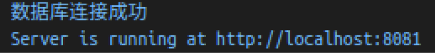

后端端口默认：localhost：3001（不建议更改，应该更改后前端也需要更改）

连接mongoDB端口默认：8081

可在app.js文件末尾进行更改

###########################################################

**前端：**

在iBlog_vue_new文件夹下打开终端：

输入 npm install

再输入npm run serve即可

启动成功将会显示：

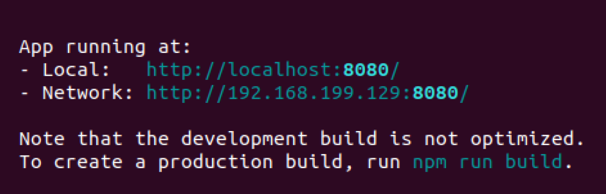

#############################################################

前后端启动成功后

再浏览器内输入localhost:8080可显示：

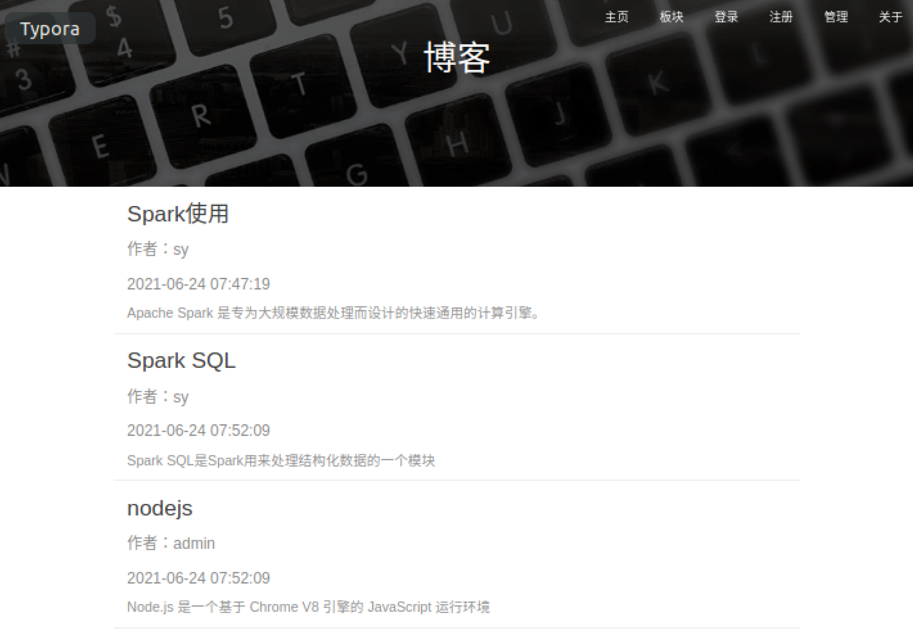

**####博客使用：**

**内容**

首页可点击内容，跳转到各个文章内：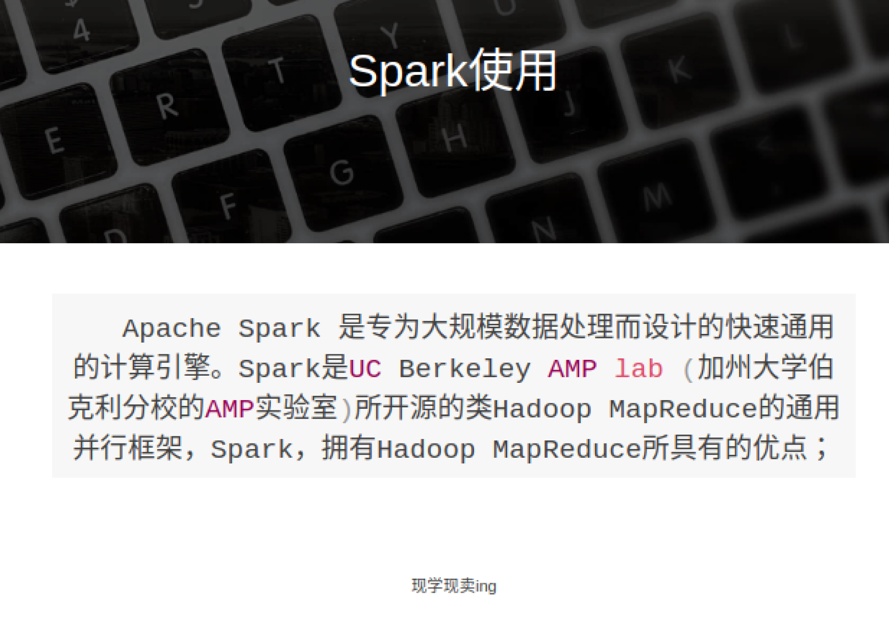

**板块**

可以在不同主题直接切换: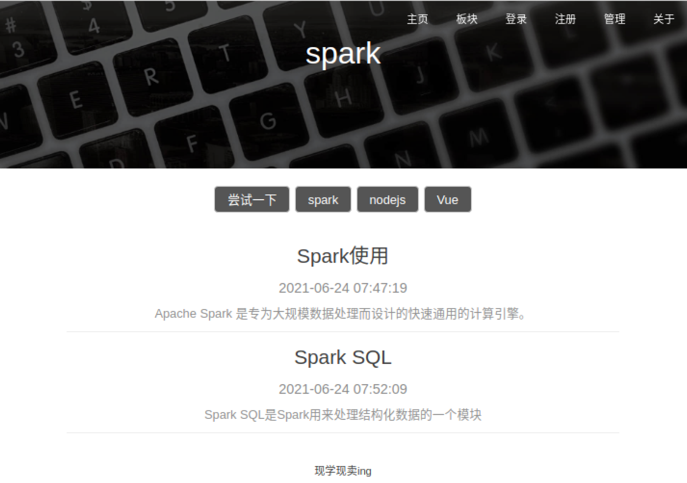

**登录界面**

验证码看不清点击可切换

账户密码错误、账号密码长度不符合、验证码错误、会出现提示：

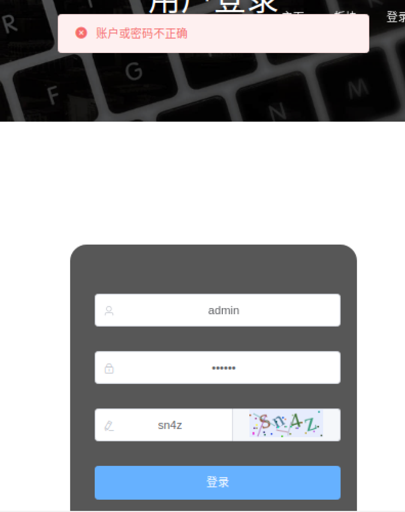

**注册界面**


账号密码长度不符合、两次密码不正确或者账户已存在将会报错：

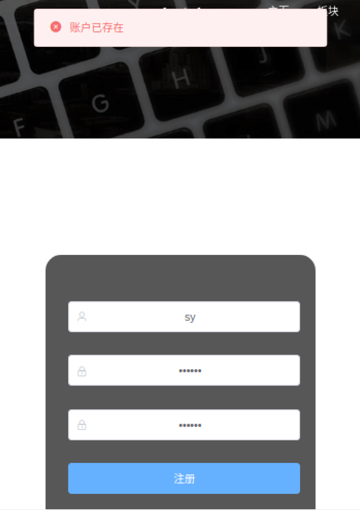


**关于**

可以显示关于博客各种东西，如Github连接

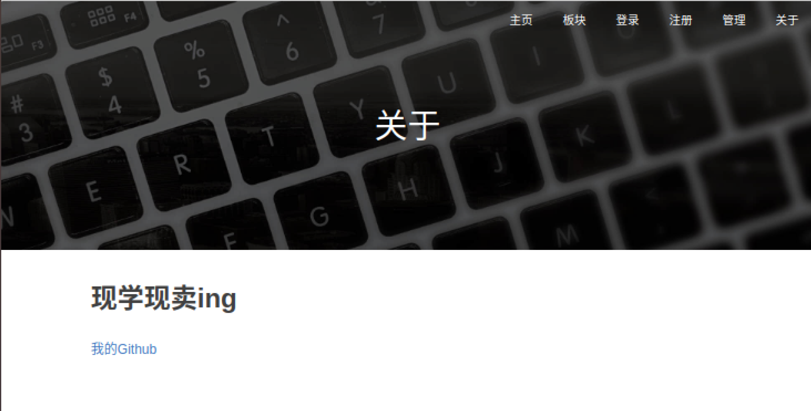

**管理**

管理端需登录后才能访问，否则出现：

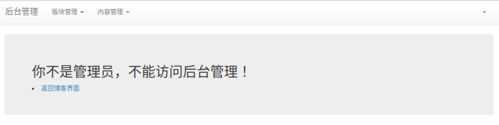

**超级管理员**

！！！！注意：

账号：admin

密码：admin

为超级管理员

只有超级管理员有用户管理权限

超级管理员界面为：

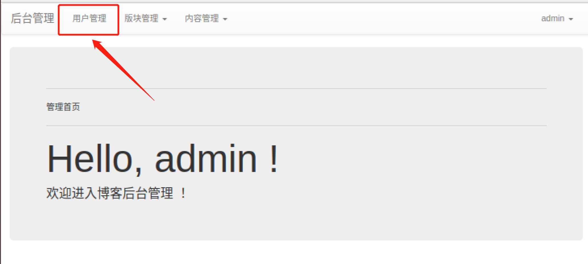

**用户管理**

可以对用户进行删除，删除用户后，该用户的所有文章都将会被删除！

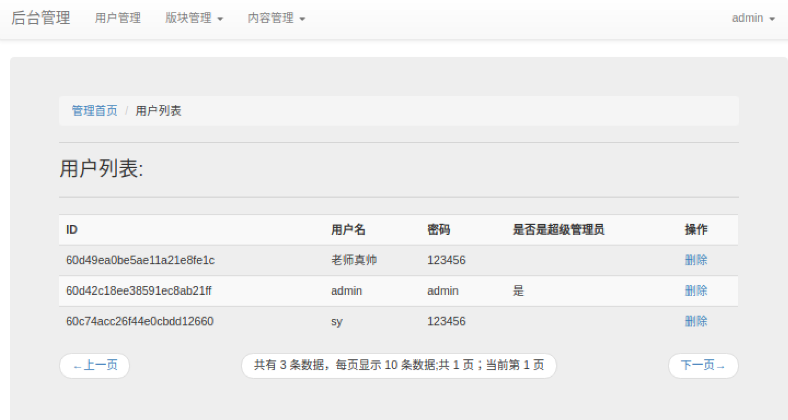

**普通管理员**

无用户管理功能

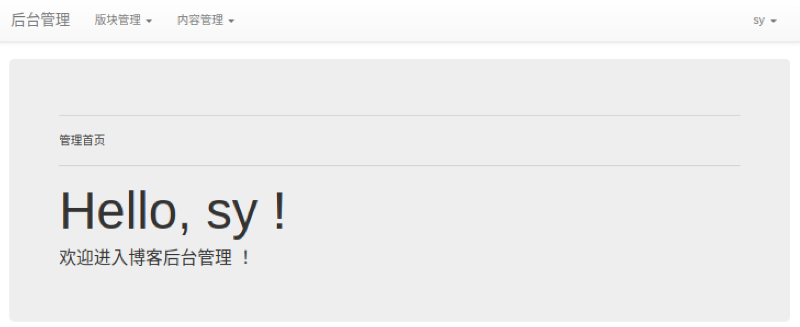

**板块管理**

拥有板块添加、板块修改、板块删除功能

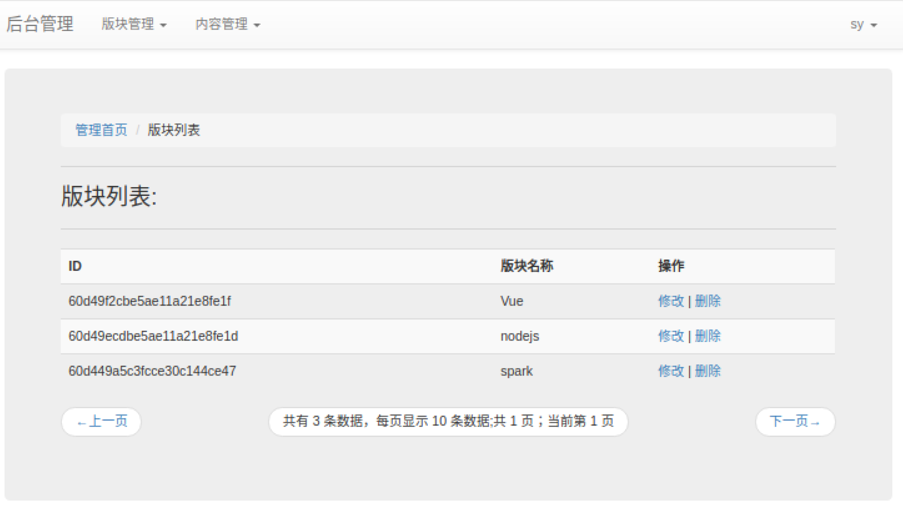

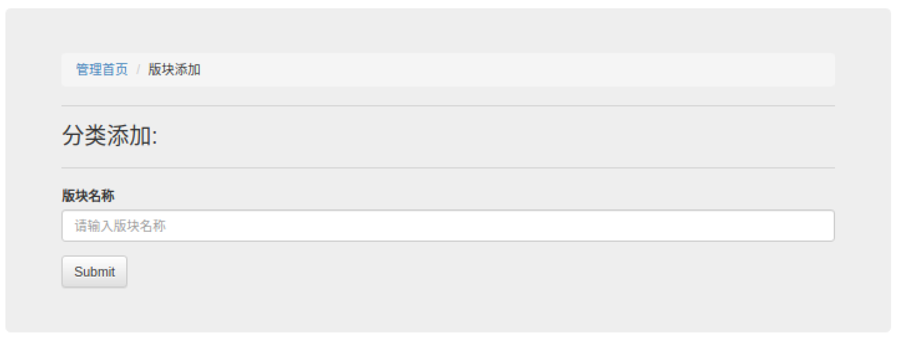

**内容管理**

拥有内容添加、内容修改、内容删除功能

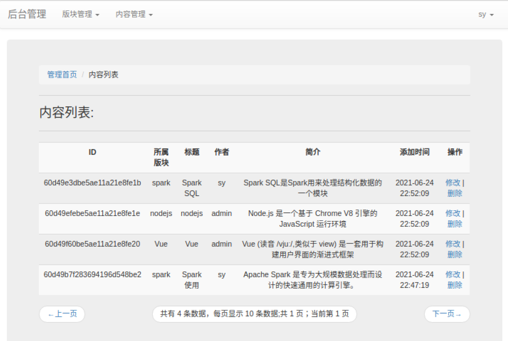

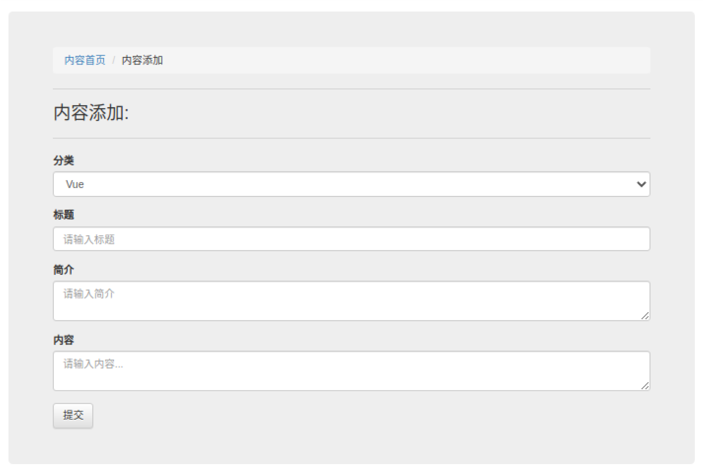

**用户退出与返回博客**

右上角实现这两个功能

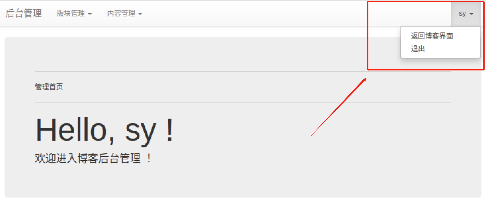

退出后：

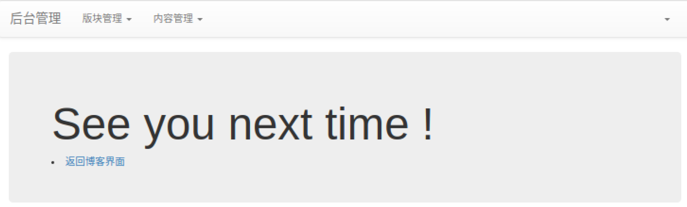